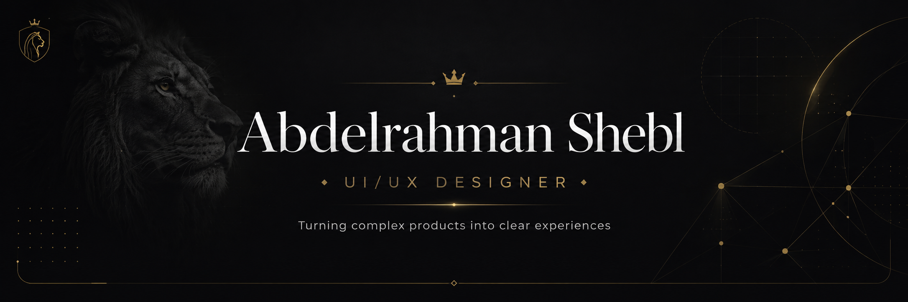
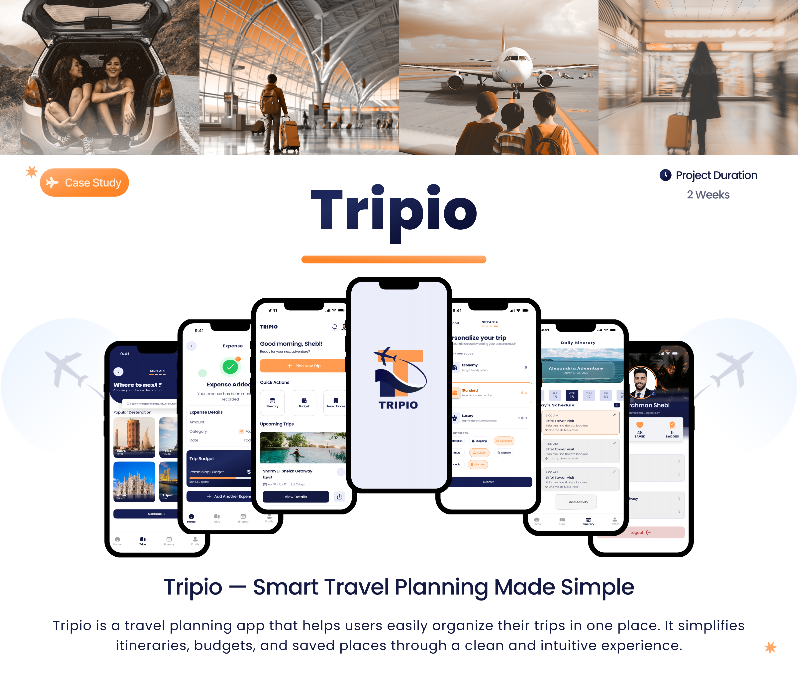
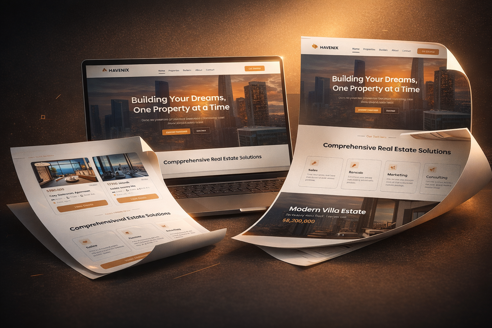

  

 

<table>
<tr>
<td width="68%" valign="middle">

## Hey, I'm Abdelrahman Shebl 👋

I'm a **UI/UX Designer** with a Computer Science background, focused on turning complex requirements, messy product flows, and technical constraints into clear and usable digital experiences.

My work sits between **Product Thinking, UX Research, Interaction Design, Systems Thinking, and Visual Craft**.

I enjoy getting into the messy part of a product — requirements, edge cases, and user flows — then simplifying the experience without losing what matters.

Currently, I'm focused on growing as a **Product Designer** and building stronger connections between user needs, business goals, and technical realities.

[**Explore My Portfolio →**](https://shebl-portfolio.vercel.app/)

</td>

<td width="32%" align="center" valign="middle">

</td>
</tr>
</table>

---

## Selected Work

<table>
<tr>

<td width="50%" valign="top">

### ✈️ Tripio

A travel-planning app that brings itineraries, budgets, saved places, and trip details into one organized flow.

[**View Case Study →**](https://www.behance.net/gallery/243708657/TRIPIO-Case-study-travel-app)

</td>

<td width="50%" valign="top">

### 🩺 DiaCare

A diabetes monitoring product that helps patients track daily health data while giving doctors a focused view of the signals that matter.

[**View Case Study →**](https://www.behance.net/gallery/244584239/DiaCare-Smart-Diabetes-Monitoring-Case-Study)

</td>

</tr>

<tr>

<td width="50%" valign="top">

### 🧵 Hirfa

A mobile learning platform for discovering crafts, following step-by-step lessons, joining workshops, and earning certificates.

[**View Case Study →**](https://www.behance.net/gallery/247312857/-UXUI)

</td>

<td width="50%" valign="top">

### 🏠 HAVENIX

A real-estate landing page designed to make listings easier to scan, build trust, and guide users toward enquiry.

[**View Case Study →**](https://www.behance.net/gallery/245559087/Real-Estate-Landing-page-HAVENIX)

</td>

</tr>
</table>

---

## Skills & Expertise

<table width="100%">
<tr>

<td width="50%" valign="top">

### 🎯 Product & UX

</td>

<td width="50%" valign="top">

### ✦ Interaction & Visual

</td>

</tr>

<tr>

<td width="50%" valign="top">

### 🧠 Product Thinking

</td>

<td width="50%" valign="top">

### 🛠 Design Tools

</td>

</tr>
</table>

---

## Technical Understanding

---

## Statistics

---

## Let's Connect

---

## Currently

- 🦁 Designing clearer digital product experiences
- 🎯 Growing toward stronger Product Design ownership
- 🌱 Improving my Framer and front-end skills
- 🧠 Exploring better ways to connect design, business, and technology
- 💼 Open to **UI/UX & Product Design opportunities**

---

  <strong>A designer's mind. A lion's courage.</strong> 🦁

  Designed with clarity. Built with intention.

